# Cloud native app

<div id="user-content-toc">
  <ul>
    <li><a href="#start-the-app">1. Start the app</a>
        <ul>
            <li><a href="#Requirements">1.1. Requirements</a>
                <ul>
                    <li><a href="#install-docker-and-minikube">1.1.1. Install Docker and Minikube</a></li>
                    <li><a href="#install-istio">1.1.2. Install Istio</a></li>
                    <li><a href="#build-the-docker-images">1.1.3. Build the Docker images (optional)</a></li>
                </ul>
            </li>
            <li><a href="#Start-the-docker-daemon">1.2. Start the Docker daemon</a></li>
            <li><a href="#Start the Minikube cluster">1.3. Start the Minikube cluster</a></li>
            <li><a href="#Deploy-the-app-in-the-minikube-cluster">1.4. Deploy the app in the Minikube cluster</a>
                <ul>
                    <li><a href="#Deploy-the-database-and-microservices-gateway">1.4.1. Deploy the database and microservices gateway</a></li>
                    <li><a href="#Deploy-the-microservices-and-service-mesh-proxies">1.4.2. Deploy the microservices and service mesh proxies</a></li>
                    <li><a href="#Get-the-access-to-the-ingress-gateway">1.4.3. Get the access to the Ingress gateway</a></li>
                </ul>
            </li>
        </ul>
    </li>
    <li><a href="#microservices">2. Microservices</a></li>
    <li><a href="#full-duplex-asynchronous-exchange-via-grpc">3. Full duplex asynchronous exchange via gRPC</a>
        <ul>
            <li><a href="#service-contract">3.1. Service contract</a></li>
        </ul>
    </li>
    <li><a href="#data-consistency--distributed-transaction-1">4. Data consistency / distributed transaction</a>
        <ul>
            <li><a href="#the-saga-pattern">4.1. The saga pattern</a></li>
        </ul>
    </li>
    <li><a href="#continuous-integration-with-github-actions">5. Continuous Integration with Github Actions</a>
        <ul>
            <li><a href="#the-ci-workflow">5.1. The CI workflow</a></li>
            <li><a href="#build-and-tests">5.2. Build and tests</a></li>
            <li><a href="#launch-a-workflow-when-the-code-is-updated">5.3. Launch a workflow when the code is updated</a></li>
        </ul>
    </li>
    <li><a href="#kubernetes">6. Kubernetes</a>
        <ul>
            <li><a href="#Pod-and-service">6.1. Pod and Service</a></li>
            <li><a href="#scalability-and-load-balancing-1">6.2. Scalability and load balancing</a></li>
            <li><a href="#auto-restart-in-case-of-failure">6.3. Auto restart in case of failure</a></li>
        </ul>
    </li>
    <li><a href="#service-mesh">7. Service mesh</a>
        <ul>
            <li><a href="#microservices-service-mesh-proxies-and-routing-via-the-gateway">7.1. Microservices, service mesh proxies and routing via the gateway</a></li>
            <li><a href="#circuit-breaker">7.2. Circuit breaker</a></li>
            <li><a href="#monotoring">7.3. Monotoring</a>
                <ul>
                    <li><a href="#display-the-kiali-dashboard">7.3.1. Display the Kiali dashboard</a></li>
                    <li><a href="#Monitoring-with-graphana">7.3.2. Monitoring with Graphana</a></li>
                </ul>
            </li>
        </ul>
    </li>
    <li><a href="#composition-of-services-via-graphql">8. Composition of services via GraphQL</a></li>
    <li><a href="#Delete-resources-and-stop-the-cluster">9. Delete resources and stop the cluster</a></li>
  </ul>
</div>

## Start the app

### Start the Docker Daemon

Start Docker

### Start the Minikube cluster
```
minikube start --cpus=2 --memory=5000 --driver=docker
```
### Deploy the app in the Minikube cluster

Set the Kubernetes config
```
kubectl apply -f configmap.yaml
```

##### Deploy the database and microservices gateway
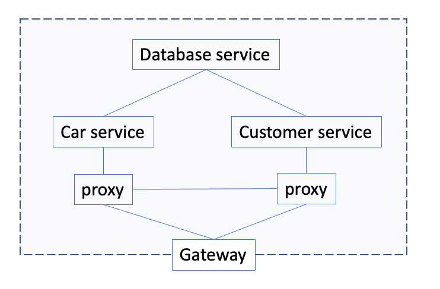

Launch the Kubernetes deployment and service for PostgreSQL, and the Ingress gataway:
```
kubectl apply -f infrastructure.yaml
```
##### Deploy the microservices and service mesh proxies

```
kubectl apply -f microservices.yaml
```
##### Get the access to the Ingress gateway
```
./ingress-forward.sh
```
Get the list of cars to be rented:
```
http://localhost:31380/carservice/cars
```
Rent 2 cars:
```
curl --header "Content-Type: application/json" --request POST --data '{"customerId":1,"numberOfCars":2}' http://localhost:31380/carservice/cars
```

## Microservices

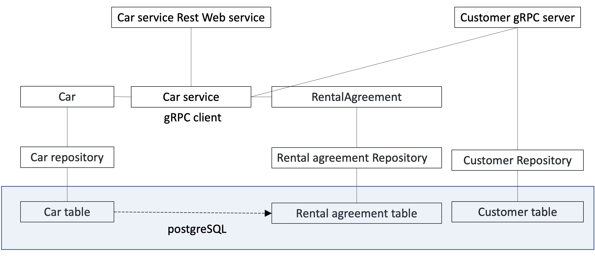

https://github.com/charroux/servicemesh/tree/main/carservice/src/main/java/com/charroux/carservice

## Full duplex asynchronous exchange via gRPC   

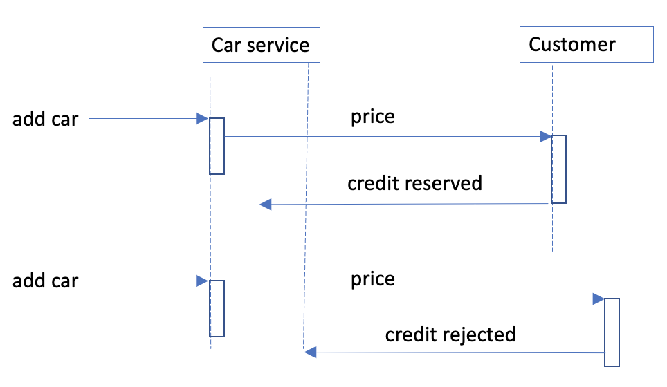

### Service contract
https://github.com/charroux/servicemesh/blob/main/carservice/src/main/proto/carservice.proto

### gRPC client
https://github.com/charroux/servicemesh/blob/main/carservice/src/main/java/com/charroux/carservice/service/RentalServiceImpl.java

### gRPC server
https://github.com/charroux/servicemesh/blob/main/carstat/src/main/java/com/charroux/carstat/CarRentalServiceImpl.java

## Data consistency / distributed transaction
### The saga pattern
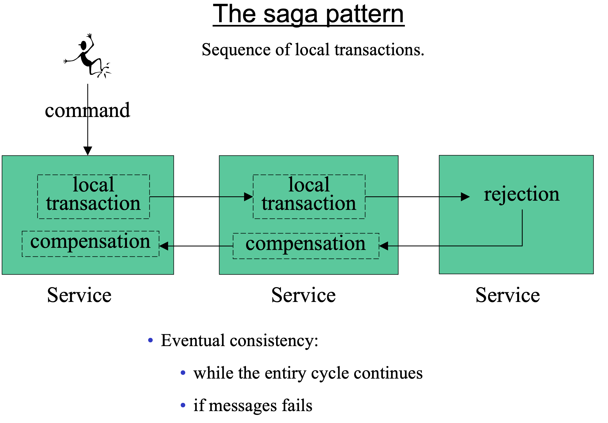

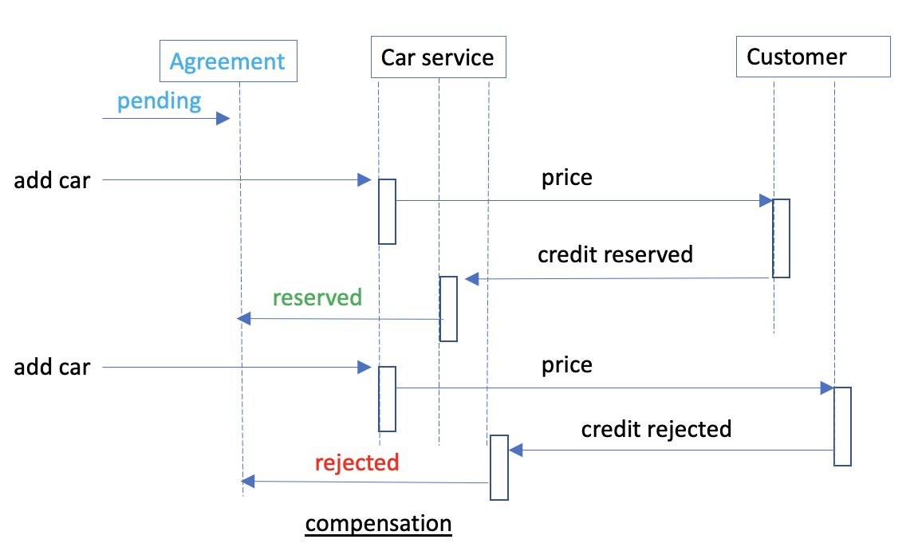

https://github.com/charroux/servicemesh/blob/main/carservice/src/main/java/com/charroux/carservice/service/RentalServiceImpl.java

## Kubernetes

### Pod and Service

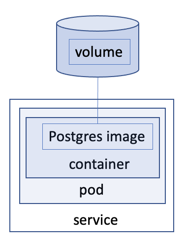

```
kubectl get pods
```
```
kubectl get services
```

https://github.com/charroux/servicemesh/blob/main/infrastructure.yaml

Enter inside the Docker containers:
```
kubectl exec -it [pod name] -- /bin/sh
```
```
ls
```
You should view the java jar file.
```
exit
```
Use Minikube to reach the carservice:
```
minikube service carservice --url
```
```
http://127.0.0.1:[port]/cars
```


### Scalability and load balancing

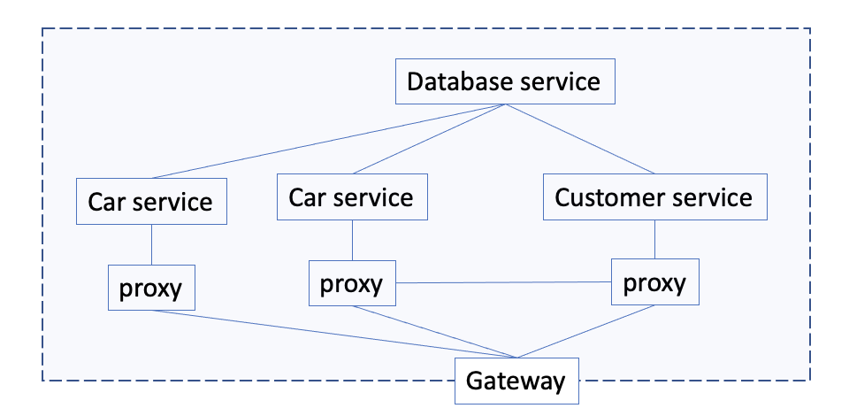

How many instance are actually running:
```
kubectl get pods
```
```
kubectl get deployments
```
Start a second instance:
```
kubectl scale --replicas=2 deployment/[deployment name]
```

### Auto restart in case of failure
```
kubectl get pods
```
```
kubectl delete pods [pod name]
```

## Continuous Integration with GitHub Actions

GitHub Actions allows to automate, customize, and execute development workflows right in a repository.

### The CI workflow

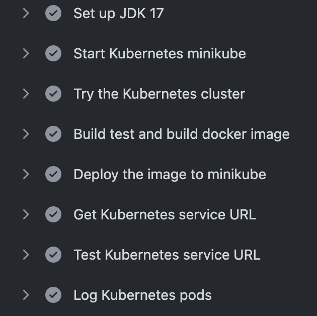

https://github.com/charroux/servicemesh/blob/main/.github/workflows/actions.yml

Kubernetes configuration to test a service in isolation: https://github.com/charroux/servicemesh/blob/main/deploymentaction.yaml

### Build and tests

In memory database for unit testing in order to test a service in isolation: https://github.com/charroux/servicemesh/blob/main/carservice/src/test/resources/application.properties

Entities test: https://github.com/charroux/servicemesh/blob/main/carservice/src/test/java/com/charroux/carservice/entity/CarRepositoryTests.java

Use of mocks to test service in isolation: https://github.com/charroux/servicemesh/blob/main/carservice/src/test/java/com/charroux/carservice/service/RentalServiceTests.java

Microservice tests: https://github.com/charroux/servicemesh/blob/main/carservice/src/test/java/com/charroux/carservice/web/CarRentalRestServiceTests.java

### Launch a workflow when the code is updated
Check an existing workflow: https://github.com/charroux/servicemesh/actions

Create a new branch: 
```
git branch newcarservice
```
Move to the new branch:
```
git checkout newcarservice
```
Update the code and commit changes:
```
git commit -a -m "newcarservice"
```
Push the changes to GitHub:
```
git push -u origin newcarservice
```
Create a Pull request on GitHub and follow the workflow.

Delete the branch:
```
git checkout main
```
```
git branch -D newcarservice
```
```
git push origin --delete newcarservice
```

## Service mesh


### Microservices, service mesh proxies and routing via the gateway


```
kubectl apply -f infrastructure.yaml
```
https://github.com/charroux/servicemesh/blob/main/infrastructure.yaml

```
kubectl apply -f microservices.yaml
```
https://github.com/charroux/servicemesh/blob/main/microservices.yaml
#### Get the access to the Ingress gateway
```
./ingress-forward.sh
```
Ask carservice the list of cars:
```
http://localhost:31380/carservice/cars
```
### Circuit breaker
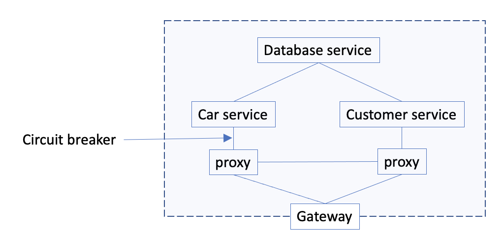

Adding a circuit breaker to carservice:
```
kubectl apply -f circuit-breaker.yaml
```
Test the circuit breaker:
http://localhost:31380/carservice/cars

Disable the circuit breaker using:
```
kubectl delete -f circuit-breaker.yaml
```
### Monotoring
#### Display the Kiali dashboard
Kiali is a console for Istio service mesh.
```
kubectl -n istio-system port-forward deployment/kiali 20001:20001
```
Launch the console: http://localhost:20001/

Active again carservice:

http://localhost:31380/carservice/cars

Then inspect the cluster in Kiali.

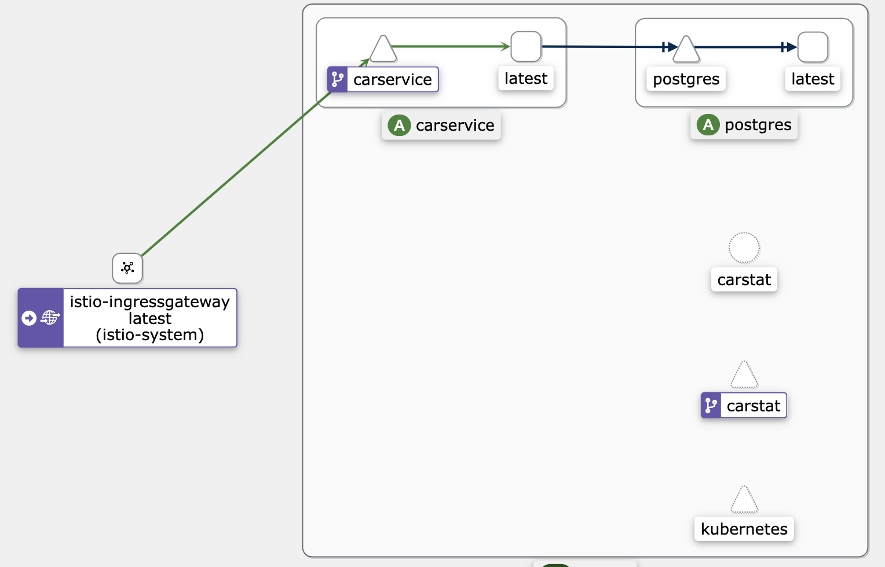

#### Monitoring with Graphana
```
kubectl -n istio-system port-forward deployment/grafana 3000:3000
```
http://localhost:3000/

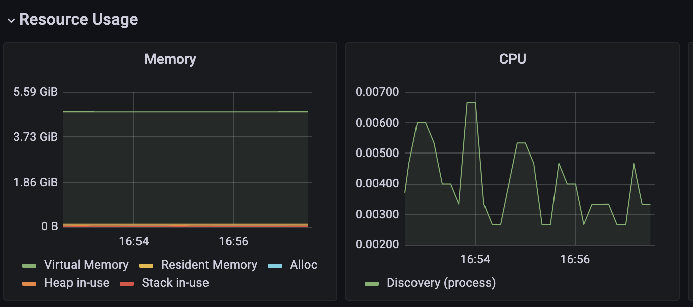

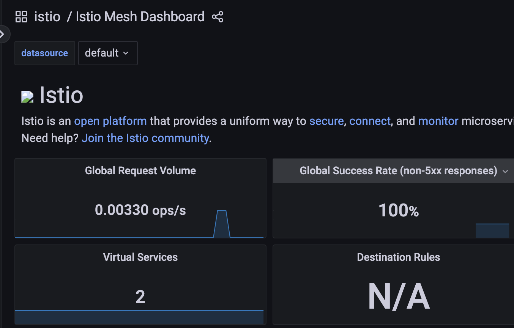

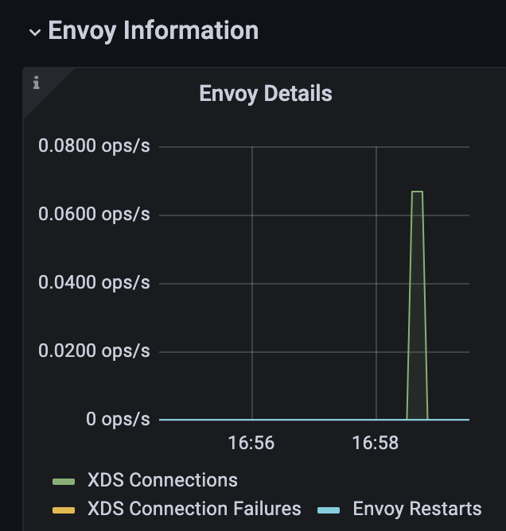


## Composition of services via GraphQL

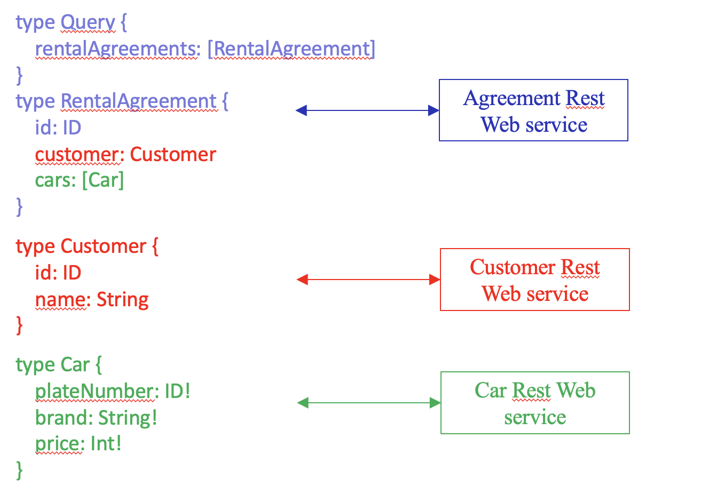

https://github.com/charroux/servicemesh/blob/main/rentalservice/src/main/resources/graphql/rentalAgreement.graphqls

https://github.com/charroux/servicemesh/blob/main/rentalservice/src/main/resources/graphql/customer.graphqls

https://github.com/charroux/servicemesh/blob/main/rentalservice/src/main/resources/graphql/car.graphqls

Server side coding:
https://github.com/charroux/servicemesh/blob/main/rentalservice/src/main/java/com/charroux/rentalservice/agreements/RentalController.java

## Delete resources and stop the cluster
```
kubectl delete -f infrastructure.yaml
```
```
kubectl delete -f microservices.yaml
```
```
minikube stop
```

# Requirements
## Install Docker and Minikube
https://www.docker.com/get-started/

https://minikube.sigs.k8s.io/docs/start/

Then start the Kubernetes cluster:
```
minikube start --cpus=2 --memory=5000 --driver=docker
```
## Install Istio
https://istio.io/latest/docs/setup/getting-started/
```
cd istio-1.17.0    
export PATH=$PWD/bin:$PATH    
istioctl install --set profile=demo -y
cd ..   
```
Enable auto-injection of the Istio side-cars when the pods are started:
```
kubectl label namespace default istio-injection=enabled
```
Install the Istio addons (Kiali, Prometheus, Jaeger, Grafana):
```
kubectl apply -f samples/addons
```
## 
Enable auto-injection of the Istio side-cars when the pods are started:
```
kubectl label namespace default istio-injection=enabled
```

Configure Docker so that it uses the Kubernetes cluster:
```
minikube docker-env
eval $(minikube -p minikube docker-env)
eval $(minikube docker-env)  
```

## Build the Docker images (optional)

Dockers images have been alreaddy build. You can find those images in the Docker hub : 

https://hub.docker.com/search?q=charroux

So you can skip the next steps.

Build the postgres image:
```
docker build --tag=charroux/postgres:1 postgres
docker push charroux/postgres:1
```
Build the carservice app:
```
cd carservice
./gradlew build
cd ..
docker build --tag=charroux/carservice:1 carservice
docker push charroux/carservice:1  
```
Build the carstat app:
```
cd carstat
./gradlew build
cd ..
docker build --tag=charroux/carstat:1 carstat  
docker push charroux/carstat:1  
```
Build the customer app:
```
cd customer
./gradlew build
cd ..
docker build --tag=charroux/customer:1 customer  
docker push charroux/customer:1  
```
Build the graphQL app:
```
cd rentalservice
./gradlew build
cd ..
docker build --tag=charroux/rentalservice:1 rentalservice  
docker push charroux/rentalservice:1  
```
Build the React app:
```
docker build --tag=charroux/carental:1 carental
docker push charroux/carental:1 
```


# cloud-native-app
